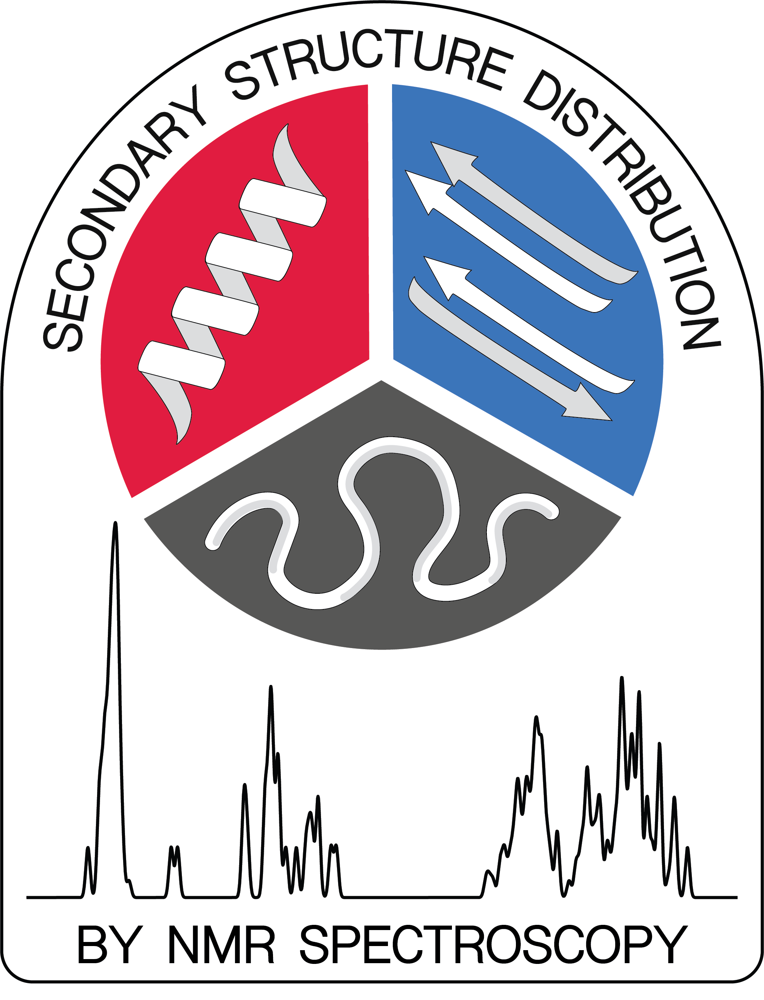
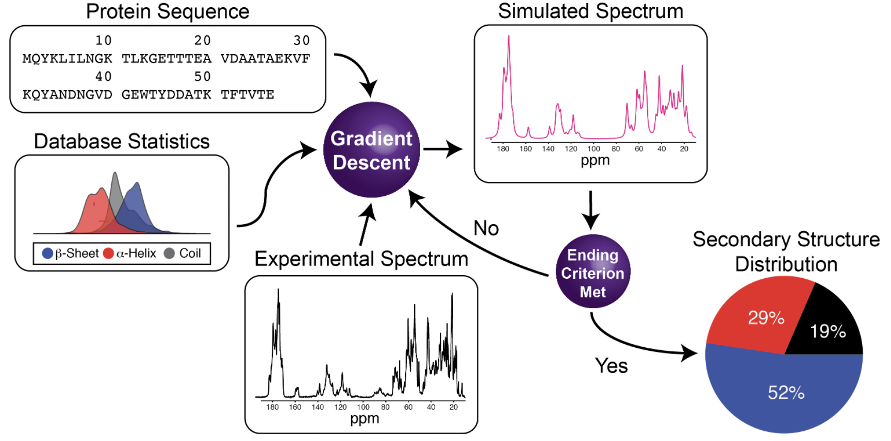

# Secondary Structure Determination by Nuclear Magnetic Resonance (SSD-NMR)


<table>
  <tr>
    <td></td>
    <td>
      <h2>Introduction</h2>
      <p>
        SSD-NMR is a method for determining the secondary structure composition of proteins using a single unassigned 1D ¹³C NMR spectrum. This repository contains the implementation of the SSD-NMR algorithm, along with example datasets and Google Colab notebooks to reproduce the results presented in our manuscript.
      </p>
    </td>
  </tr>
</table>

<table>
  <tr>
    <td></td>
    <td></td>
  </tr>
</table>

## Features

- Rapid and accurate determination of protein secondary structure composition
- Requires only a single unassigned 1D ¹³C NMR spectrum and the protein's primary sequence
- Applicable to proteins in solution, solid-state, and other complex environments
- Robust performance for a wide range of experimental conditions and spectral qualities


## Getting Started
### Google Colab Notebook
For a quick and easy way to try SSD-NMR, check out our Google Colab Notebook

[](https://colab.research.google.com/drive/10t5P9UlA97Uxn-zm2xd19-a8anljQKwO?usp=sharing)


### Local Installation
To run SSD-NMR locally, first clone this repository and install the required dependencies:
```
cd SSD-NMR
pip install -r requirements.txt
```
#### Usage
SSD-NMR can be run from the command line with the following syntax:
```
python GD.py <spectrum_file> <ppm_column> <protein_name> <sequence> <self_reference>
```
For example:
```
python GD.py MDT_gb1_referenced.csv ppm gb1 MQYKLILNGKTLKGETTTEAVDAATAEKVFKQYANDNGVDGEWTYDDATKTFTVT True
```


## Examples
The "Examples" folder contains a set of pre-configured Google Colab notebooks and sample spectra that reproduce the results presented in our manuscript.

## Citation
For references, a preprint of this work is available:  Li H, Tuttle M, Zilm K, Batista V. Rapid Quantification of Protein Secondary Structure Composition from a Single Unassigned 1D 13C NMR Spectrum. ChemRxiv. 2024; doi:10.26434/chemrxiv-2024-qt9g4


For questions, comments, or support, please contact the authors:

- Haote Li (haote.li@yale.edu)
- Marcus D. Tuttle (marcus.tuttle@yale.edu)
